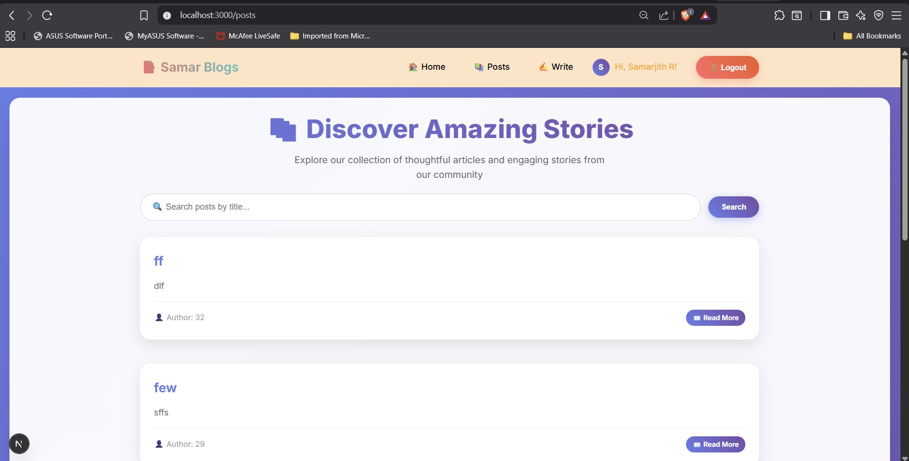
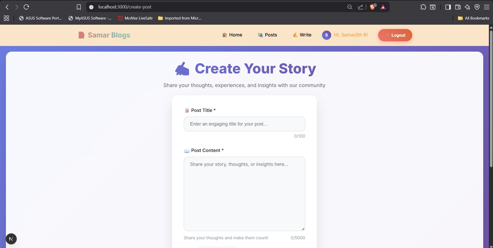
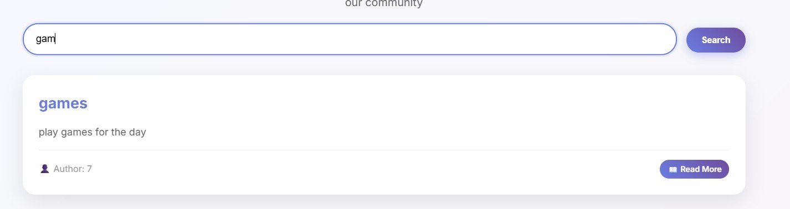

# 📰 Full-Stack Blogging App - Backend

This is the **backend** for the Full-Stack Blogging App (v1.0).  
It provides authentication (JWT + Google SSO via Passport.js), database operations using **Supabase (PostgreSQL)**, and RESTful APIs for managing users and posts.

---

## Tech Stack

- **Backend Framework:** Express.js  
- **Authentication:** Passport.js (Google OAuth 2.0) + JWT  + bcrypt for password hashing with salt rounds
- **Database:** Supabase (PostgreSQL)  
- **Validation:** express-validator  
- **Environment Variables:** dotenv  
- **Testing:** Jest  
- **Deployment:** Render  

---

## install dependencies
-**npm install**-to install dependencies
-**npm start**-to run the server
-**npm test**-to run tests

## API reference

**POST**-auth/register-used to get post data
**POST**-auth/login-verify login and assign jwt
**GET**-auth/google-google authentication page
**GET**-/posts-get all posts
**PUT**-/posts/:id-update all posts
**DELETE**-/posts/:id-delete a post

## AI helped with:

-Structuring Passport.js Google OAuth

-Writing validation middleware

-Creating sample Jest tests

# Full-Stack Blogging App - Frontend

## Tech Stack

- **Framework:** React.js / Next.js  
- **State Management:** React Context API / useState + useEffect  
- **Routing:** React Router / Next.js Routing  
- **Forms & Validation:** React Hook Form / custom validation  
- **Authentication:** JWT stored in localStorage / cookies, Google SSO integration  
- **API Integration:** Fetch API / Axios  
- **Styling:** Tailwind CSS / CSS Modules  
- **Testing:** React Testing Library (RTL)  
- **Deployment:** Vercel  

---

## Deployment:
-Backend-render,
-frontend-vercel,
-Database-Supabase.

## screenshots

- **Posts Page:**  
  

  - **Create Posts Page:**  
  

  - **Home Page:**  
  

   - **Search Posts:**  
  

    - **Pagination:**  
  

  ##  Installation & Setup

# Install dependencies
npm install

# Run the development server
npm run dev

# Run tests
npm test

## Author
-Samarjith R

